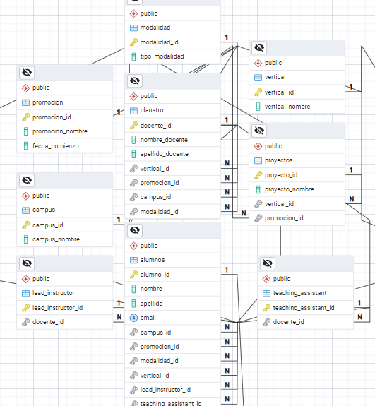
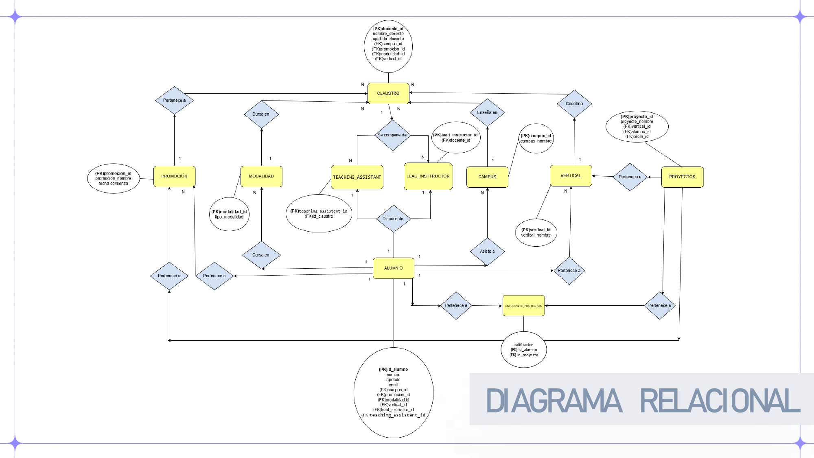
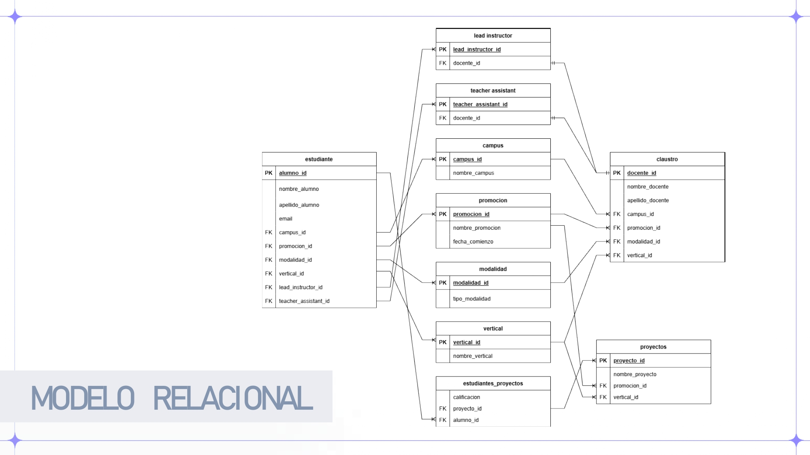

# 🎓 Proyecto de Base de Datos SQL

<p align="center">
  
</p>


## 📋 Descripción

Este proyecto consiste en el diseño e implementación de una base de datos relacional utilizando **SQL**. El propósito de esta base de datos es gestionar la información de **estudiantes**, **promociones**, **modalidades**, **campus**, **verticales**, **docentes (claustro)** y **proyectos** en una plataforma educativa. Cada entidad está interrelacionada para ofrecer una visión integral de los elementos clave en la organización académica.

## 📐 Diagrama Entidad-Relación (ERD)

Se ha diseñado un diagrama entidad-relación (ERD) para modelar la estructura de la base de datos, donde se representan las tablas, las claves primarias (PK) y las claves foráneas (FK) que permiten las relaciones entre las diferentes entidades.

A continuación se presenta el diagrama ERD generado por el software ***pgAdmin4*** utilizado en el proyecto:

<p align="center">
    
</p>

Aquí se presenta el Diagrama Relacional: 

<p align="center">
    
</p>

Aquí se presenta el Modelo Relacional: 

<p align="center">
    
</p>

## 🗃️ Estructura de la Base de Datos

Las principales tablas y sus relaciones son:

- **Estudiantes**: Almacena la información de los estudiantes matriculados.
- **Promoción**: Información sobre las distintas promociones académicas.
- **Modalidad**: Detalles sobre las modalidades de estudio.
- **Campus**: Información sobre los distintos campus educativos.
- **Verticales**: Categorías o áreas de conocimiento.
- **Claustro (Docentes)**: Información de los docentes encargados de los cursos.
- **Proyectos**: Proyectos realizados por los estudiantes en sus respectivas verticales.
- **Lead_instructors**: Profesores que lideran los bootcamps.
- **Teacher assistant**: Antiguos alumnos convertidos en colaboradores de los profesores.
- **Estudiantes_proyectos**: Incluye la calificación de cada alumno por proyecto.

### 📑 Detalle de las Tablas

1. **Estudiantes**  
   - `ID_estudiante` (PK)
   - `nombre_alumno`
   - `apellido_alumno`
   - `email`
   - `FK_ID_campus`
   - `FK_ID_promocion`
   - `FK_ID_modalidad`
   - `FK_ID_vertical`
   - `FK_ID_LI`
   - `FK_ID_TA`

2. **Promoción**
   - `ID_promocion` (PK)
   - `nombre_promocion`
   - `fecha_comienzo`

3. **Modalidad**
   - `ID_modalidad` (PK)
   - `tipo_modalidad`

4. **Campus**
   - `ID_campus` (PK)
   - `nombre_campus`

5. **Verticales**
   - `ID_vertical` (PK)
   - `nombre_vertical`

6. **Claustro (Docentes)**
   - `ID_docente` (PK)
   - `nombre_docente`
   - `apellido_docente`
   - `FK_ID_campus`
   - `FK_ID_promocion`
   - `FK_ID_modalidad`
   - `FK_ID_vertical`

7. **Proyectos**
   - `ID_proyecto` (PK)
   - `nombre_proyecto`
   - `FK_ID_estudiante`
   - `FK_ID_promocion`
   - `FK_ID_vertical`

8. **Proyectos**
   - `ID_proyecto` (PK)
   - `nombre_proyecto`
   - `FK_ID_estudiante`
   - `FK_ID_promocion`
   - `FK_ID_vertical`

9. **Lead_instructors**
   - `ID_lead_instructor` (PK)
   - `FK_docente_id`

10. **Teacher_assistants**
   - `ID_teacher_assistant` (PK)
   - `FK_docente_id`

## 🛠️ Instalación

Para ejecutar este proyecto, sigue los siguientes pasos:

1. Clona este repositorio a tu máquina local.
   ```bash
   git clone https://github.com/tu_usuario/nombre_del_proyecto.git
2. Carga el script SQL proporcionado en tu servidor de base de datos.

3. Asegúrate de tener configurada tu base de datos con las credenciales correctas en el archivo de configuración.

## ✅ Requisitos
- Un servidor de bases de datos compatible con SQL (e.g. MySQL, PostgreSQL).
- Conocimiento básico de SQL para ejecutar las consultas necesarias.

## 🚀 Uso
Una vez que la base de datos esté configurada y los datos iniciales se hayan insertado, podrás realizar consultas relacionadas con:

- 👨‍🎓 Alumnos matriculados en diferentes promociones y modalidades.
- 📝 Proyectos desarrollados por los estudiantes.
- 👩‍🏫 Claustro docente y las asignaciones de cursos.

## 👥 Integrantes del Proyecto
Este proyecto ha sido desarrollado por los siguientes alumnos de **THE BRIDGE**:

- Javier Rodríguez
- Nathan Jones
- Paula García
- Rubén Castro
- Sergio Ortega

<p align="center">
  
</p>
